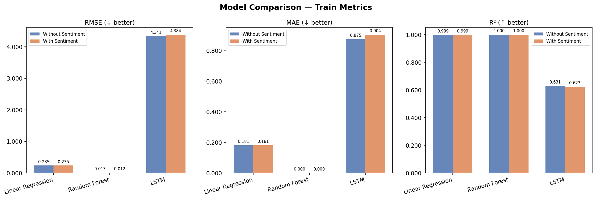
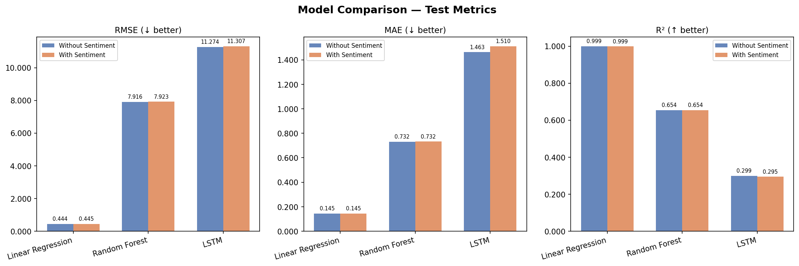
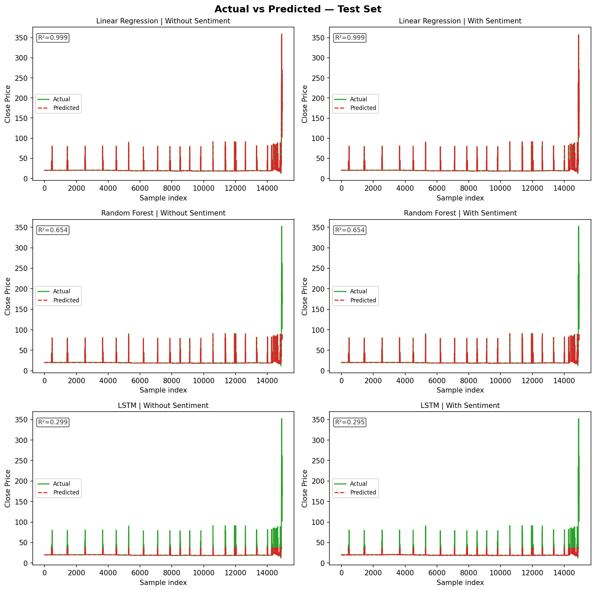
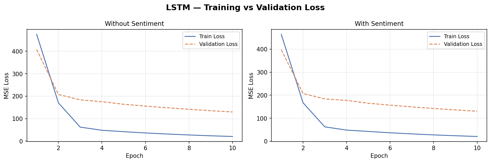
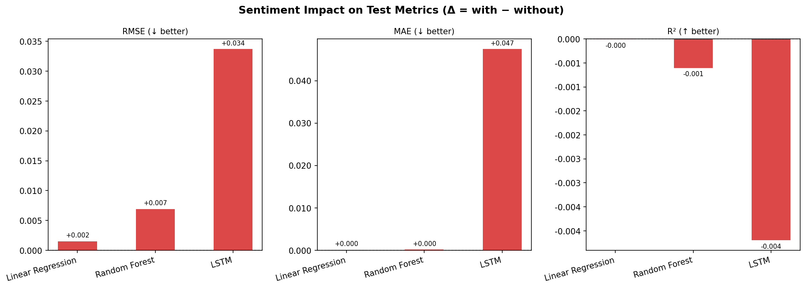

# Model Evaluation Report

> Auto-generated on **2026-03-08 06:48:43**

## Overview

This report compares **Linear Regression**, **Random Forest**, and **LSTM** on a stock
close-price prediction task, evaluated with and without Twitter sentiment features.

**Features without sentiment (6):** open, high, low, volume, running_max, running_min  
**Additional sentiment features (2):** positiveness, negativeness  
**Target:** close price  

---

## Training Set Metrics

| Model | Sentiment | RMSE ↓ | MAE ↓ | R² ↑ |
|---|---|---|---|---|
| Linear Regression | Without | 0.2351 | 0.1814 | 0.9989 |
| Linear Regression | With | 0.2351 | 0.1814 | 0.9989 |
| Random Forest | Without | 0.0125 | 0.0003 | 1.0000 |
| Random Forest | With | 0.0123 | 0.0004 | 1.0000 |
| LSTM | Without | 4.3406 | 0.8751 | 0.6308 |
| LSTM | With | 4.3837 | 0.9044 | 0.6234 |

---

## Test Set Metrics (Validation)

| Model | Sentiment | RMSE ↓ | MAE ↓ | R² ↑ |
|---|---|---|---|---|
| Linear Regression | Without | 0.4439 | 0.1448 | 0.9989 |
| Linear Regression | With | 0.4454 | 0.1449 | 0.9989 |
| Random Forest | Without | 7.9156 | 0.7318 | 0.6544 |
| Random Forest | With | 7.9225 | 0.7319 | 0.6538 |
| LSTM | Without | 11.2737 | 1.4629 | 0.2990 |
| LSTM | With | 11.3074 | 1.5103 | 0.2948 |

---

## Sentiment Feature Impact (Test Set)

Δ = metric_with_sentiment − metric_without_sentiment  
For RMSE/MAE: negative Δ = improvement. For R²: positive Δ = improvement.

| Model | ΔRMSE | ΔMAE | ΔR² |
|---|---|---|---|
| Linear Regression | +0.0015 ❌ | +0.0001 ❌ | -0.0000 ❌ |
| Random Forest | +0.0069 ❌ | +0.0002 ❌ | -0.0006 ❌ |
| LSTM | +0.0337 ❌ | +0.0475 ❌ | -0.0042 ❌ |

---

## LSTM Loss History (final epoch)

| Variant | Final Train Loss | Final Val Loss |
|---|---|---|
| Without Sentiment | 20.459168 | 129.654149 |
| With Sentiment | 20.826739 | 130.425589 |

---

## Plots

### Training Metrics Comparison

### Test Metrics Comparison

### Actual vs Predicted (Test Set)

### LSTM Training & Validation Loss

### Sentiment Feature Impact

